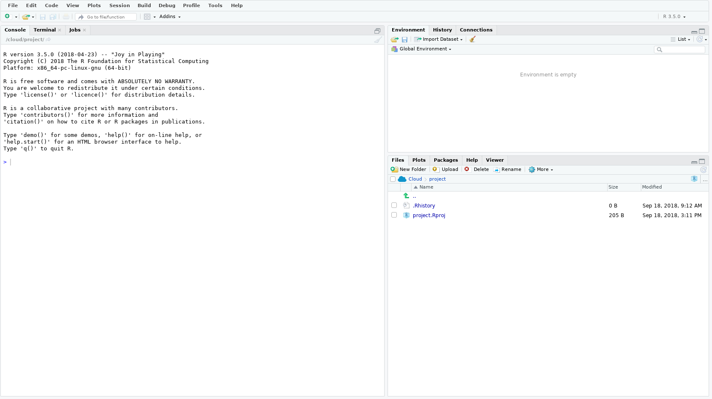
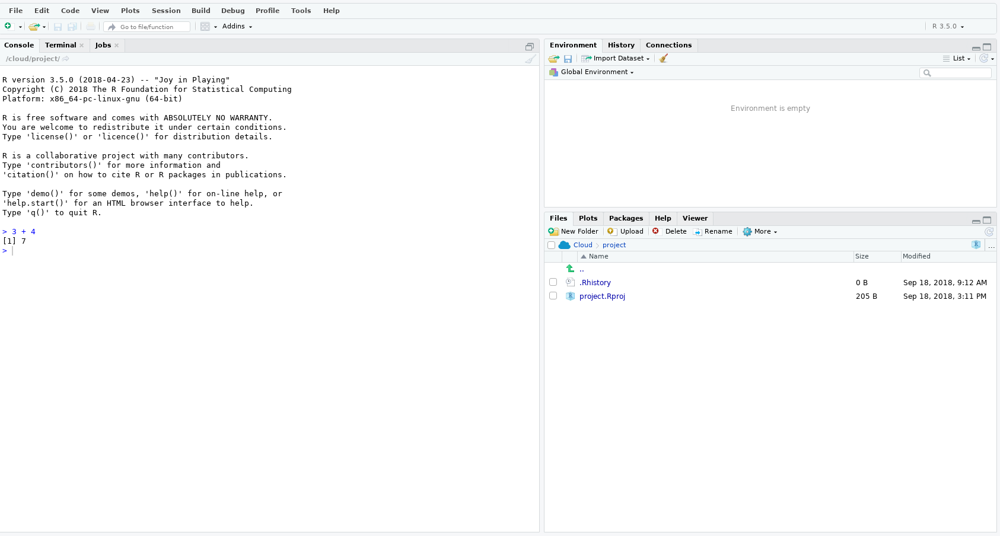

```{r setup, include=FALSE}
knitr::opts_chunk$set(echo = TRUE)
```

## Install R and RStudio

From **NIWA Apps** install {width=2%} (**R**) and  {width=2%} (**RStudio**), I found both under **Programming**.


**R** is a computer language and **RStudio** is a widely used Graphical User Interface (GUI) that calls it in the background.

To check everything is working open up **RStudio** {width=2%}, if you use Windows use the Search Windows box to locate. 

Once opened you should see something like this 

The section with the curser is called the **Console**. To test all is working, where the curser is type `3 + 4` and press enter. If all has gone well you should see something like this 

##### ******You can now close **RStudio** down as you are ready for the first session.******

## Basics

### Some terminology

- **Console**: the text-based interface between you and the computer. This is where you tell the computer what to do.

- **Script**: the code file you write telling the computer what to do.

- **Run**: the act of actually implementing your code telling the computer what to do.

- **Syntax**: how the language is written and what characters mean.

- **Function**: sort of like a rule that dictates what you want to calculate.

- **Argument**: an object you would give a function to calculate something.

- **Package**: a collection/suite of functions/commands. If you want to use a specific package you must first install it: run `install.packages("name_of_package")` in **R** (you only need to do this once, think of it as downloading a book to your digital library). To then use the functionality offered by that package you need to call the package so that **R** knows where to look, kind of like requesting a specific book from your library. To call up the package run `library(name_of_package)` in R (you need to do this once in each **R** session you want to access the package's functionality).

### Don't have a dirty workspace

In **RStudio**. **Tools >> Global Options** 

- Uncheck *Restore .RData into workspace at startup*
- Uncheck *Restore most recently opened project at startup*
- Uncheck *Always save history (even when not saving .RData)*
- Set *Save workspace to .RData on exit:* to Never

[{width=10%}](https://whattheyforgot.org/save-source.html#always-start-r-with-a-blank-slate)
**Always start R wih a blank slate**

### Basic operations

```{r basic, eval = TRUE}
## Start a line with hash and you can write your own comments
## This helps future you understand what present you was doing.
## To add two numbers
3 + 4 ## When run the number 7 should appear in your console
## Multiply two numbers
3 * 4
## "Create" and object x and give it the value 3
x <- 3
## So what is x? Type x and find out
x
## What is x - 1?
x - 1
## To create a vector of numbers 1--5
y <- c(1,2,3,4,5) 
## or
z <- 1:5
## Print them to the console
y
z
## times y by x
y*x
## the mean of y
mean(y)
```

### Errors

Honestly they are in English!

Try typing your name into the console

```{r error,error=TRUE}
Charlotte ## An Error should be printed to your console
```

Why is this? It's because `Charlotte` doesn't exist in **R** because I haven't created it.

Armed with a little common sense most Errors are easy to decipher. If not ask Google...

## Introduction to R (First practical session)

### Setting your "working directory"

- In **RStudio** follow **Session >> Set Working Directory >> Choose Directory...** 

- Or in your console run `setwd("path/to/your/directory")`

### Open an `.r` script

- **File >> New File >> R Script**

This is where you'll type your commands and the "Run" them in the console.


### HELP

There are a few ways to ask R for help without resorting to using [Google](https://www.google.com/). Try running the following code.
```{r help, eval = FALSE}
?mean ## will open up a screen with a description of the function mean()
args(mean) ## prints the arguments the function takes to the console
```

### Reading in data

Most data files can be read into **R** using a single line of code. If you haven't set your working directory (see above) to the folder where your data file is then you **must** put in the full path to the file. 

Functions to read in the two main types of data file extensions are listed below. In both instances the data are read in and saved as the **R** object `data`.

```{r read in, eval = FALSE}
## read in a .csv
data <- read.csv("path/to/your/file.csv")
## read in a .txt file
data <- read.table("path/to/your/file.txt")
## NOTE for Windows machines instead of / use \\ (e.g., "C:\\Users\\Charlotte\\Documents\\file.csv")
```

In addition, **RStudio** offers a point and click version: **Import Dataset** (top right panel).

Let's read in a `.csv` file. First download [this file](https://git.niwa.local/jonestoddcm/Statistics-and-R/blob/master/data/ecoli.csv) into your working directory, The file includes some Ecoli data.

```{r read in csv,echo = 2:3}
setwd("../data")
## read the file into R
ecoli <- read.csv("ecoli.csv") ## or the replace the .csv file name with the file name you've chosen
```

### Inspecting and accessing data

Let's look at the first few rows of the data.

```{r head}
head(ecoli)
```

To access a specific element of the data we use the `$` character. For example, to access the column of sites you would use `ecoli$site`. Alternatively you can use the `[]` brackets to access elements of the ecoli. For example, to access the fourth row you would type `ecoli[4,]`. You could also access the *site* column using `ecoli[,5]` as this is the 5th column. Note to access a certain row the number goes **before** the comma and the column number goes **after**. A blank either side means access **all** that row or column.

Run the following commands and see if you can work out what they're doing. Use the ## to write your own comments in your script.

```{r, eval = FALSE}
str(ecoli)
table(ecoli$site)
summary(ecoli$value)
median(ecoli$value)
boxplot(ecoli$value ~ ecoli$site)
?mapply ## what do you expect this function to do?
mapply(summary, ecoli[,5:6])
?aggregate
aggregate(ecoli$value, by = list(ecoli$site),mean) ## what does this give you?
```


### Save your script

**File >> Save** or **Ctrl S**

[{width=10%}](https://whattheyforgot.org/save-source.html)**Everything that really matters should be achieved through code that you save.**

### Week One "Homework"

The following activities rely on you having read in the ecoli data you downloaded in class as the object **data** (not **ecoli** as above).

- calculate the mean of the *value* column and save it as the object **mean.val** [HINT: to save the median of the value column as **median.val** you might use `median.val <- median(data$value)` ]

- find the 0.99 quantile of the *value* column and save it as the object **nn.quantile** [HINT: running `quantile(data$value, probs = 0.95)` will calculate the quantile corresponding to a probability of 0.95]

- install and then load the package **devtools** [Hint: to install the package **mgcv** you would run `install.packages("mgcv")` and to load it you might run `library(mgcv)`]

- create an object called **loc.max** containing the maximum values of *value* at each location [HINT: use the `aggregate` and `max` functions]


If you want to "mark" you homework run this command `devtools::source_url("https://raw.githubusercontent.com/cmjt/scripts/master/markR/week_one.r", sha1 = "262bfa2514223d04ca68eaff5f306b8d33c87b30")`.

[{width=10%}](https://swcarpentry.github.io/r-novice-inflammation/01-starting-with-data/index.html)**Didn't think that was enough**


## Plotting and exploratory data analysis (Second practical session)

Some of this session will use the Ecoli dataset we used last week. If you haven't already done so please download [this file](https://git.niwa.local/jonestoddcm/Statistics-and-R/blob/master/data/ecoli.csv).

To load the data into your R session either use the **Import Dataset** (top right panel) or the R command `read.csv()` covered [here](#reading-in-data)

Let's have a look again at the data. Try running all or just a couple of the following commands (these assume your data is called **ecoli**)

```{r str, eval = FALSE}
str(ecoli) ## prints a summary of the components of the dataset to screen
head(ecoli) ## prints the first 6 observetions to the screen
tail(ecoli) ## prints the last 6 observetions to the screen
head(ecoli,n = 25) ## prints the first 25 observetions to the screen
```

### Function arguments

Last time we learnt that an R **function** (a type or calculation or rule) typically has **arguments** (options or data you want to use in the calculation). 

It is worth noting that:

- R functions arguments can be matched positionally or by name. Therefore the following calls to **mean** are equivalent `mean(ecoli$value)`
`mean(x = ecoli$value)`, `mean(x = ecoli$value, na.rm = FALSE)`,  and `mean(na.rm = FALSE, x = ecoli$value)`. Try it for yourself.

- You can mix positional matching with matching by name. When an argument is matched by name, it is “taken out” of the argument list and the remaining unnamed arguments are matched in the order that they are listed in the function definition. For example, try`mean(na.rm = FALSE, ecoli$value)`. 


### Basic descriptive (summary) statistics

#### Measures of centrality

```{r basic des}
mean(ecoli$value) ## mean value
median(ecoli$value) ## median value

```

#### Measures of spread


```{r spread}
range(ecoli$value) ## range
var(ecoli$value) ## variance
sd(ecoli$value) ## standard deviation
min(ecoli$value) ## minimum
max(ecoli$value) ## maximum
```

#### Other descriptive statistics

```{r other des}
quantile(ecoli$value, probs = c(0.25,0.75)) ## quantiles corresponding to the given probabilities ()
summary(ecoli$value) ## summary of the data
fivenum(ecoli$value) ## Tukey's five number summary (minimum, lower-hinge, median, upper-hinge, maximum) 

```

### Summary statistics for multiple columns


For the following exercise we will be using data already "in" R. Run `data(airquality)` to access this data followed by `?airquality` to read about what this dataset contains.

Try using the `mapply()` function touched on in [this section](#inspecting-and-accessing-data) coupled with the summary statistics above to best summarize the airquality data.

```{r mapp}
## getting maens of all columns
mapply(mean,airquality,2) ## first argument the function, second argument the the name of the data frame, third the index 1 = rows, 2 = columns
## Now try
mapply( mean,airquality,2, na.rm = TRUE) ## the extra argument  ignores the NA values when evaluating the function this is because the na.rm argument is an option of the function mean, and so to tell mapply to parse it in we add it as an extra argument

```

### Plotting data

For the following exercise we will again be using data already "in" R as well as both the airquality and Ecoli data above. Run `data(npk)` to access this data followed by `?npk` to read about what this dataset contains. Now try printing the data to screen (don't worry there are only 24 observations) `npk`. What do you see? What does `table(npk[,2:4])` do?

#### The humble plot() function

Run the following and notice the different plots produced. This is because the **plot()** function tries its best to work out the type of data you are passing it and makes the most appropriate plot (mostly...)

```{r, eval = FALSE}
plot(ecoli$value)
plot(ecoli$location)
plot(ecoli$date, ecoli$value)
pairs(airquality, panel = panel.smooth, main = "airquality data")
```


#### Other plots

```{r other plots, eval = FALSE}
pairs(airquality, panel = panel.smooth, main = "Airquality data") ## look at possible relationships
hist(npk$yield, main = "Histogram of yield") ## look at distribution using a histogram
barplot(table(ecoli[,4])) ## bar plot of counts of ecoli locations
boxplot(npk$yield ~ npk$block, ylab = "NPK yield", xlab = "Block number") ## boxplot of NPK yield by block (NOTE the ~ here)
## Whay about a density and rug plot (this requires two calls)
plot(density(ecoli$value), main = "Ecoli desnity") ## plot a smoothe density plot of ecoli
rug(ecoli$value) ## add a rug plot to it
```

You'll have noticed a few times we have customized the titles or axis labels of the plots above. Try finding out what other customization is possible to each plot. [HINT: use `?plot` to see what arguments there are. What does `plot(npk$yield, type = "l", col = 3)` do?]

#### Introducing the **ggplot2** package for plotting. 

To install the package **ggplot2** run `install.packages("ggplot2")` and to load run `library(ggplo2)`

The **ggplot2** package is a suite of tools designed for data visualization. Some people think this package makes it easier to visually asses your data. Using ggplot requires a slightly different syntax to base R. As you'll notice when running the code below the `+` symbol is used to "add" things to the plot

```{r ggplot}
library(ggplot2)
ggplot(aes(x = block,y = yield),data = npk) + geom_boxplot() + ggtitle("NPK") ## boxplots of NPK by block. Is there a difference between blocks?
ggplot(aes(x = site,y = value, color = as.factor(run)),data = ecoli) + geom_boxplot() + ggtitle("Ecoli values") + labs(color = "run number") ## boxplots of ecoli split by site and coloures by run number. Is there a difference between sites
ggplot(data = airquality, aes(x = Temp, fill = as.factor(Month))) + geom_density(alpha = .3)  + labs(fill = "Month number") ## density plots NY temperature by month
```

Try changing some of the arguments and see what happens (e.g., what does `ggplot(aes(x = site,y = value, color = location),data = ecoli) + geom_boxplot() + ggtitle("Ecoli values") ` show you.)

In each of the plots above some values are shown split by some condition (e.g., month, location). Do there appear to be differences? How might you assess if these differences are "significant"? Come along next time to find out.

### Week two "Homework"

Make a barplot showing the means of the Ecoli values at each site with error bars showing +/- 2 times the standard error around the mean (two possibilities shown below). NOTE: the standard error of the mean of some data can be calculated as the standard deviation divided by the square root of the number of observations, i.e., $$ se = \frac{sd}{\sqrt{(n)}}. $$

HINT: You will need to calculate the means and standard errors for each site. Research the `points()` and `arrows()` functions to add stuff to your barplot. To save the x coordinated used in a barplot you will need to save it as an object (e.g., running `bar <- barplot(table(ecoli[,4]))` will create a vector of x coordinates of each bar called **bar**.)

```{r w2 homework,echo = FALSE}
mns <- aggregate(ecoli$value, by = list(ecoli$site), mean) ## calculate means for each site
ses <- aggregate(ecoli$value, by = list(ecoli$site),  sd)$x/sqrt(aggregate(ecoli$value, by = list(ecoli$site),  length)$x) ## calculate standard errors for each site
plot.data <- data.frame(sites = mns$Group.1,means = mns$x,ses = ses, upper =  mns$x + 2*ses, lower =  mns$x - 2*ses) ## create data frame of data (optional for ggplot)


## Using base graphics
b.cent <- barplot(mns$x, names.arg = mns$Group.1,axes = FALSE, ylim = c(0,210)) ## need to "create" the barplot to return centre locations of each bar
points(b.cent,mns$x, pch = 20,xpd = TRUE) ## add the mean values
arrows(b.cent, mns$x - 2*ses, b.cent, mns$x + 2*ses, lwd = 2,code = 0) ## put in the erroe lines

## Using ggplot2
library(ggplot2)
ggplot(plot.data, aes(x = sites, y = means)) + 
    geom_bar(position = position_dodge(), stat="identity") +
    geom_errorbar(aes(ymin = lower, ymax = upper), width = 0.2) + ylab("Mean of Ecoli") + xlab("Sites")
```

<div class="toggle"><button>Solution</button>
```{r w2 homework soln,eval = FALSE}
mns <- aggregate(ecoli$value, by = list(ecoli$site), mean) ## calculate means for each site
ses <- aggregate(ecoli$value, by = list(ecoli$site),  sd)$x/sqrt(aggregate(ecoli$value, by = list(ecoli$site),  length)$x) ## calculate standard errors for each site
plot.data <- data.frame(sites = mns$Group.1,means = mns$x,ses = ses, upper =  mns$x + 2*ses, lower =  mns$x - 2*ses) ## create data frame of data (optional for ggplot)


## Using base graphics
b.cent <- barplot(mns$x, names.arg = mns$Group.1,axes = FALSE, ylim = c(0,210)) ## need to "create" the barplot to return centre locations of each bar
points(b.cent,mns$x, pch = 20,xpd = TRUE) ## add the mean values
arrows(b.cent, mns$x - 2*ses, b.cent, mns$x + 2*ses, lwd = 2,code = 0) ## put in the erroe lines

## Using ggplot2
library(ggplot2)
ggplot(plot.data, aes(x = sites, y = means)) + 
    geom_bar(position = position_dodge(), stat="identity") +
    geom_errorbar(aes(ymin = lower, ymax = upper), width = 0.2) + ylab("Mean of Ecoli") + xlab("Sites")
```
</div>

[{width=10%}](https://datacarpentry.org/R-ecology-lesson/04-visualization-ggplot2.html)**Try some more data visualization with ggplot2**


## Hypothesis testing (Third practical session)

### Confidence intervals

A confidence interval can be thought of as a plausiable range within which we might expect the true value of some unknown population parameter to lie. The level of "confidence" associated with this interval typically reflects the proportion of time we would expect an interval to contain the true value of the parameter. For example, if we were making inference about the population mean and based on a single sample had calculated a sample mean of 52 and a 95% confidence interval of (49,55), then when repeating the sampling 100 times we would expect the "true" mean to be between 49 and 55 95 times.


#### Bootstrapping to calculate a confidence interval for the population mean.

Using the airquality data we're going to bootstrap for the confidence interval of the population mean

```{r boot}
y <- airquality$Temp ## create a vector of te,perature values called y
N <- 10000 ## The number of times to resample
Y <- numeric(N) ## Create a vector of 10000 zeros, this is where we'll store the resampled means
## Note R is case sensitive so Y and y are different
## Code to carry out the reampling
for(i in 1:N){
  ## calculate the mean from a sample
  ## of size = length y from y
  ## with replacement
  Y[i] <- mean(sample(y,length(y), replace = TRUE))
}
## plot a histogram of these bootstrap samples
hist(Y)
## print a summary of these bootstrap values
summary(Y) ## note as we are resampling randomly the values won't be exactly the same for everyone.
```
We can see that the mean of **Y** is roughly the same as the original sample (`r round(mean(y),3)`), but there is a lot less scatter. A 95% bootstrap conficence interval for the expected air temperature is given by

```{r expect}
quantile(Y,probs = c(0.025, 0.975)) ## i.e., 2.5% in lower tail and 2.5% in upper tail
```

So we can say that the expected air temperature (in NY over the dates in the dataset) is somewhere between `r round(quantile(Y,probs = c(0.025)),3)` and `r round(quantile(Y,probs = c(0.975)),3)` 95% of the time.

#### Boostrapping and the t-distribution

[{width=10%}](https://www.khanacademy.org/math/ap-statistics/sampling-distribution-ap/sampling-distribution-mean/v/central-limit-theorem)**The sampling distribution of the sample means approaches a normal distribution as the sample size gets larger. Otherwise know as the central limit theorem**

Using the standard error of an estimate we can calculate a 95% conficence interval (CI). For the population mean a 95% confidence interval can is calculated as $$\bar \mu \pm t_{97.5}\: se_\mu$$ where $\bar \mu$ is the sample mean, $se_\mu$ is the standard error of the mean, and $t_{97.5}$ is the t-multplier (the 97.5% quantile of the t-distribution). This multiplier is based on the confidence level desiered and depends on the sample size. A standard error of some estimated parameter is a measure of accuracy of the estimate. The standard error of a mean, $se_\mu$ can be written as $$ se_\mu = \frac{sd}{\sqrt{(n)}} $$ where $sd$ is the standard deviation of the sample and $n$ is the sample size. 

```{r compare}
## Now let's compare the bootstrap CI to the one based on the t-distribution
## bootstrap 
quantile(Y,probs = c(0.025, 0.975)) ## i.e., 2.5% in lower tail and 2.5% in upper tail
## t-distribution
mean(y) + c(-1,1)*qt(1 - 0.025, df = length(y) - 1)*sd(y)/sqrt(length(y)) ## can you work out what each bit of this code is doing?

```

From this we can see that the bootstrap and the t-distribution are equivalent.

### One sample t-test and a NULL linear model

```{r t-test}
## a one sample t-test
t.test(y)
##  fit the NULL model 
model.null <- lm(y ~ 1) ## and R object of this fitted model is created
summary(model.null) ## print summary (NOTE the estimate of the population mean is called "Intercept")
## let's calculate the confidence interval
confint(model.null)
```

From the output we can see that the one sample t-test is an example of a linear model.

NOTE: A paired comparisons is the same as a one sample t-test. This is when two measurements are taken from the same person say, which is an example of a repeated measures (twice) study.

#### Independent comparisons (a two sample t-test)

```{r ecoli t-test}
t.test(value ~ site, data = ecoli)
## Can this be formulated as a linear model?
summary(lm(value ~ site, data = ecoli))
```


#### Inference when there are more than two samples

```{r anova}

```

<!-- java script code for toggle button--> 
<script>
  $(".toggle").click(function() {
    $(this).toggleClass("open");
  });
</script>

