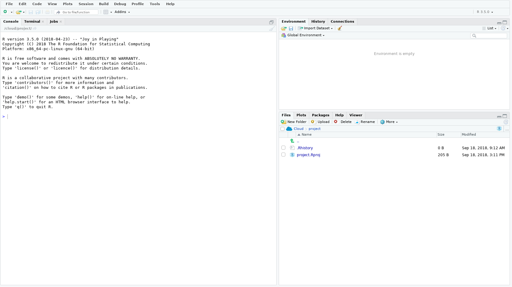

```{r setup, include=FALSE}
knitr::opts_chunk$set(echo = TRUE)
```

## Install R and RStudio

From **NIWA Apps** install {width=2%} (**R**) and  {width=2%} (**RStudio**), I found both under **Programming**.


**R** is a computer language and **RStudio** is a widely used Graphical User Interface (GUI) that calls it in the background.

To check everything is working open up **RStudio** {width=2%}, if you use Windows use the Search Windows box to locate. 

Once opened you should see something like this 

The section with the curser is called the **Console**. To test all is working, where the curser is type `3 + 4` and press enter. If all has gone well you should see something like this 

##### ******You can now close **RStudio** down as you are ready for the first session.******

## Basics

### Some terminology

- **Console**: the text-based interface between you and the computer. This is where you tell the computer what to do.

- **Script**: the code you write telling the computer what to do.

- **Run**: the act of actually implementing your code telling the computer what to do.

- **Syntax**: how the language is written and what characters mean.

- **Function**: sort of like a rule that dictates what you want to calculate.

- **Argument**: an object you would give a function to calculate something.

- **Package**: a collection/suite of functions/commands. If you want to use a specific package you must first install it: run `install.packages("name_of_package")` in **R** (you only need to do this once, think of it as downloading a book to your digital library). To then use the functionality offered by that package you need to call the package so that **R** knows where to look, kind of like requesting a specific book from your library. To call up the package run `library(name_of_package)` in R (you need to do this once in each **R** session you want to access the package's functionality).

### Don't have a dirty workspace

In **RStudio**. **Tools >> Global Options** 

- Uncheck *Restore .RData into workspace at startup*
- Uncheck *Restore most recently opened project at startup*
- Uncheck *Always save history (even when not saving .RData)*
- Set *Save workspace to .RData on exit:* to Never

[{width=10%}](https://whattheyforgot.org/save-source.html#always-start-r-with-a-blank-slate)
**Always start R wih a blank slate**

### Basic operations

```{r basic, eval = TRUE}
## Start a line with hash and you can write your own comments
## This helps future you understand what present you was doing.
## To add two numbers
3 + 4 ## When run the number 7 should appear in your console
## Multiply two numbers
3 * 4
## "Create" and object x and give it the value 3
x <- 3
## So what is x? Type x and find out
x
## What is x - 1?
x - 1
## To create a vector of numbers 1--5
y <- c(1,2,3,4,5) 
## or
z <- 1:5
## Print them to the console
y
z
## times y by x
y*x
## the mean of y
mean(y)
```

### Errors

Honestly they are in English!

Try typing your name into the console

```{r error,error=TRUE}
Charlotte ## An Error should be printed to your console
```

Why is this? It's because `Charlotte` doesn't exist in **R** because I haven't created it.

Armed with a little common sense most Errors are easy to decipher. If not ask Google...

## Introduction to R

### Setting your "working directory"

- In **RStudio** follow **Session >> Set Working Directory >> Choose Directory...** 

- Or in your console run `setwd("path/to/your/directory")`

### Open an `.r` script

- **File >> New File >> R Script**

This is where you'll type your commands and the "Run" them in the console.


### HELP

There are a few ways to ask R for help without resorting to using [Google](https://www.google.com/). Try running the following code.
```{r help, eval = FALSE}
?mean ## will open up a screen with a description of the function mean()
args(mean) ## prints the arguments the function takes to the console
```

### Reading in data

Most data files can be read into **R** using a single line of code. If you haven't set your working directory (see above) to the folder where your data file is then you **must** put in the full path to the file. 

Functions to read in the two main types of data file extensions are listed below. In both instances the data are read in and saved as the **R** object `data`.

```{r read in, eval = FALSE}
## read in a .csv
data <- read.csv("path/to/your/file.csv")
## read in a .txt file
data <- read.table("path/to/your/file.txt")
```

In addition, **RStudio** offers a point and click version: **Import Dataset** (top right panel).

Let's read in a `.csv` file. First download [this file](https://git.niwa.local/jonestoddcm/Statistics-and-R/blob/master/data/ecoli.csv) into your working directory, The file includes some Ecoli data.

```{r read in csv,echo = 2:3}
setwd("../data")
## read the file into R
data <- read.csv("ecoli.csv") ## or the replace the .csv file name with the file name you've chosen
```

### Inspecting and accessing data

Let's look at the first few rows of the data.

```{r head}
head(data)
```

To access a specific element of the data we use the `$` character. For example, to access the column of sites you would use `data$site`. Alternatively you can use the `[]` brackets to access elements of the data. For example, to access the fourth row you would type `data[4,]`. You could also access the *site* column using `data[,5]` as this is the 5th column. Note to access a certain row the number goes **before** the comma and the column number goes **after**. A blank either side means access **all** that row or column.

Run the following commands and see if you can work out what they're doing. Use the ## to write your own comments in your script.

```{r, eval = FALSE}
str(data)
table(data$site)
summary(data$value)
median(data$value)
boxplot(data$value ~ data$site)
?mapply ## what do you expect this function to do?
mapply(summary, data[,5:6])
?aggregate
aggregate(data$value, by = list(data$site),mean) ## what does this give you?
```


### Save your script

**File >> Save** or **Ctrl S**

[{width=10%}](https://whattheyforgot.org/save-source.html)**Everything that really matters should be achieved through code that you save.**

### Week One "Homework"

The following activities rely on you having read in the ecoli data you downloaded in class as the object **data**.

- calculate the mean of the *value* column and save it as the object **mean.val** [HINT: to save the median of the value column as **median.val** you might use `median.val <- median(data$value)` ]

- find the 0.99 quantile of the *value* column and save it as the object **nn.quantile** [HINT: running `quantile(data$value, probs = 0.95)` will calculate the quantile corresponding to a probability of 0.95]

- install and then load the package **devtools** [Hint: to install the package **mgcv** you would run `install.packages("mgcv")` and to load it you might run `library(mgcv)`]

- create an object called **loc.max** containing the maximum values of *value* at each location [HINT: use the `aggregate` and `max` functions]


If you want to "mark" you homework run this command `devtools::source_url("https://raw.githubusercontent.com/cmjt/scripts/master/markR/week_one.r", sha1 = "bf36d6e8b332d73adbc42391c098edac4678b19e")`.
