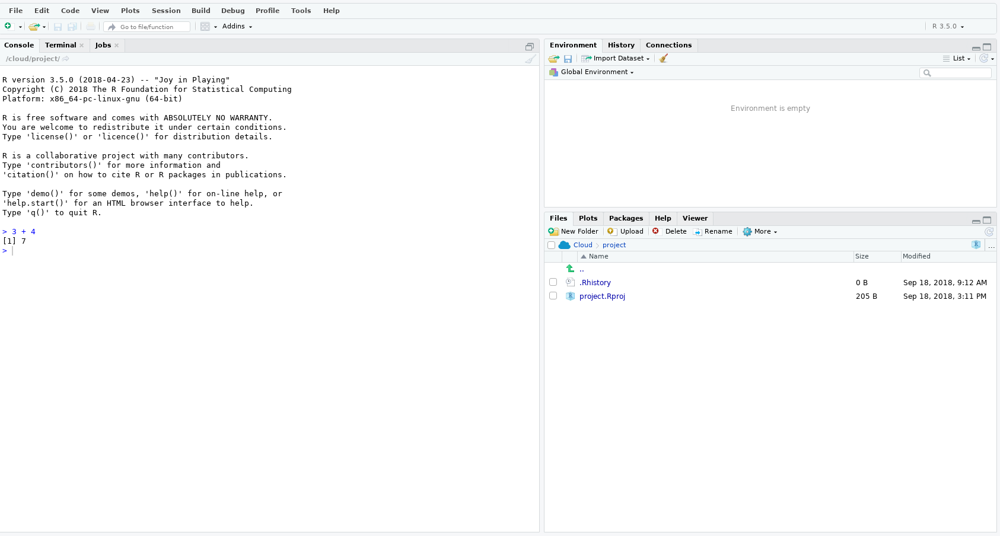

```{r setup, include=FALSE}
knitr::opts_chunk$set(echo = TRUE)
```

## Install R and RStudio

From **NIWA Apps** install {width=2%} (**R**) and  {width=2%} (**RStudio**), I found both under **Programming**.


**R** is a computer language and **RStudio** is a widely used Graphical User Interface (GUI) that calls it in the background.

To check everything is working open up **RStudio** {width=2%}, if you use Windows use the Search Windows box to locate. 

Once opened you should see something like this 

The section with the curser is called the **Console**. To test all is working, where the curser is type `3 + 4` and press enter. If all has gone well you should see something like this 

You can now close **RStudio** down as you are already for the first session.